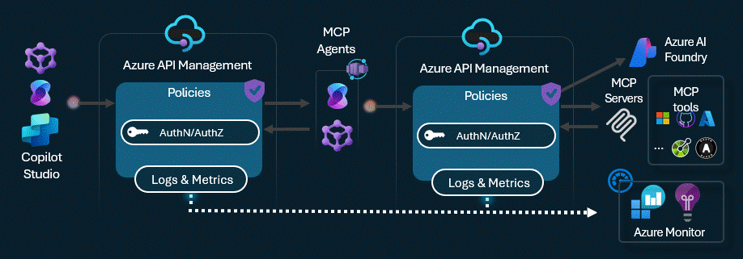
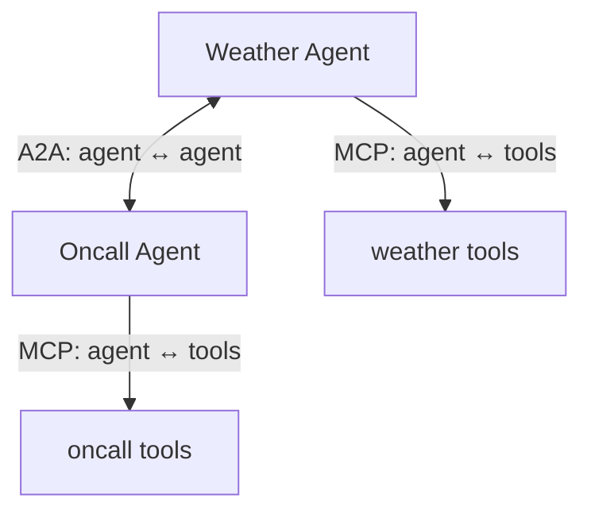
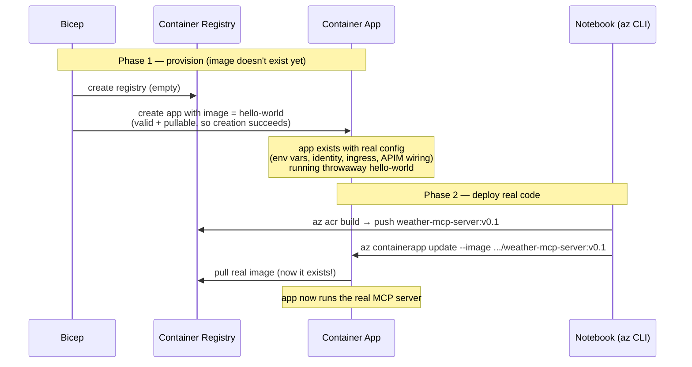

# APIM ❤️ AI Agents

## MCP-enabled A2A agents lab (initial release)


Playground to experiment with [A2A-enabled](https://www.microsoft.com/en-us/microsoft-cloud/blog/2025/05/07/empowering-multi-agent-apps-with-the-open-agent2agent-a2a-protocol/?msockid=3fc737ab34566ad7248a2255359d6b2c) agents with [Model Context Protocol](https://modelcontextprotocol.io/) with Azure API Management to enable plug & play of tools to LLMs. Leverages the [credential manager](https://learn.microsoft.com/en-us/azure/api-management/credentials-overview) for  managing OAuth 2.0 tokens to backend tools and [client token validation](https://learn.microsoft.com/en-us/azure/api-management/validate-jwt-policy) to ensure end-to-end authentication and authorization.   
This lab includes the following MCP servers:
- Basic oncall service: provides a tool to get a list of random people currently on-call with their status and time zone.
- Basic weather service: provide tools to get cities for a given country and retrieve random weather information for a specified city.
- GitHub Issues MCP Server: provide tools to authenticate on GitHub using the APIM Credential Manager, retrieves user information, and lists issues for a specified repository. This [sequence diagram](./diagrams/diagrams.md) explains the flow.

MCP-enabled agents are then deployed within ACA (Azure Container Apps) as A2A agents, both built with Microsoft Agent Framework.

This lab demonstrates the art of the possible of creating a multi-agentic system with agents orchestrated using Microsoft Agent Framework, and then allowing a single unifying protocol to communicate across them through APIM for Authn/Authz

### 🧭 MCP vs A2A — when and why

MCP and A2A are **complementary**, not competing. They solve two different problems:

- **MCP (Model Context Protocol)** connects *an agent* **down** to its **tools, data, and actions**. The other side is a tool that does what it's told (get weather, query a DB, call an API).
- **A2A (Agent-to-Agent)** connects *one agent* **across** to **another autonomous agent**. The other side is a peer that reasons, plans, and has its *own* tools.



| If you need… | Use |
|---|---|
| Your agent to *do* something (call an API, fetch data) | **MCP** |
| Your agent to hand part of a job to *another agent* | **A2A** |
| Specialist agents (each with their own tools) to collaborate | **A2A on top of MCP** |

In this lab both layers are used together: the **weather/oncall MCP servers** are pure tools (MCP), and the **agents** consume those tools over MCP while exposing themselves to other agents/clients over A2A (or as MCP servers under an orchestrator). APIM sits in the middle of every hop for authentication, rate limiting, and observability.

### Prerequisites

- [Python 3.13 or later](https://www.python.org/) installed
- [VS Code](https://code.visualstudio.com/) installed with the [Jupyter notebook extension](https://marketplace.visualstudio.com/items?itemName=ms-toolsai.jupyter) enabled
- [Python environment](https://code.visualstudio.com/docs/python/environments#_creating-environments) with the [requirements.txt](../../requirements.txt) or run `pip install -r requirements.txt` in your terminal
- [An Azure Subscription](https://azure.microsoft.com/free/) with [Contributor](https://learn.microsoft.com/en-us/azure/role-based-access-control/built-in-roles/privileged#contributor) + [RBAC Administrator](https://learn.microsoft.com/en-us/azure/role-based-access-control/built-in-roles/privileged#role-based-access-control-administrator) or [Owner](https://learn.microsoft.com/en-us/azure/role-based-access-control/built-in-roles/privileged#owner) roles
- [Azure CLI](https://learn.microsoft.com/cli/azure/install-azure-cli) installed and [Signed into your Azure subscription](https://learn.microsoft.com/cli/azure/authenticate-azure-cli-interactively)

### 🚀 Get started

Run the notebooks in the following order. Open each one in VS Code and execute the cells from top to bottom.

#### Step 1 — Deploy the shared infrastructure (required first)

Open [deploy-a2a-infra-assests.ipynb](deploy-a2a-infra-assests.ipynb) and run all cells. This notebook:

1. Initializes the notebook variables (resource group, location, model deployment, etc.).
2. Verifies the Azure CLI and the connected subscription.
3. Creates the deployment using Bicep ([main.bicep](main.bicep)) — provisions API Management, Azure OpenAI, Log Analytics, and Application Insights.
4. Builds and deploys the MCP tool servers (weather and oncall) to Azure Container Apps.
5. Tests the connection to the MCP servers and lists the available tools.

> The other lab notebooks depend on the outputs of this notebook, so it must complete successfully before continuing.

#### Step 2 — Run a lab notebook

Pick one (or both) of the following labs. Each one reads the deployment outputs from Step 1, builds the agent container images, deploys them to Azure Container Apps, and lets you interact with the agents.

- **A2A Protocol lab** — [mcp-agent-as-a2a-server.ipynb](mcp-agent-as-a2a-server.ipynb): deploys two A2A agents (both built with **Microsoft Agent Framework**) and exercises agent-to-agent communication over the A2A protocol, including a CLI client.
- **Agent-over-MCP lab** — [mcp-agent-as-mcp-server.ipynb](mcp-agent-as-mcp-server.ipynb): exposes the MCP-enabled agents as MCP servers and has them communicate agent-to-agent over MCP.

### 🏗️ How the deployment works

The lab uses a **two-phase "provision-then-swap"** pattern. Bicep ([main.bicep](main.bicep)) creates every Container App with a public **placeholder image** (`docker.io/jfxs/hello-world:latest`), and the notebooks later swap in the real images.

Why a placeholder? A Container App can't be created without a valid, pullable image — but the real images don't exist yet at Bicep run time, because the Container Registry is created *by* Bicep. So a public throwaway image satisfies the requirement at creation; the notebooks then build the real images with `az acr build` and swap them in with `az containerapp update` — cheaply and repeatedly, without re-running Bicep.

```mermaid
flowchart TB
    subgraph P1["🟦 STEP 1 — Provision infrastructure (main.bicep)"]
        direction TB
        BICEP["az deployment / Bicep run"]
        ACR["Azure Container Registry<br/>(created empty)"]
        APIM["API Management"]
        AOAI["Azure OpenAI"]
        OBS["Log Analytics + App Insights"]
        ENV["Container Apps Environment"]

        BICEP --> ACR
        BICEP --> APIM
        BICEP --> AOAI
        BICEP --> OBS
        BICEP --> ENV

        subgraph SHELLS["Container App shells — all created with placeholder image<br/>docker.io/jfxs/hello-world:latest"]
            direction LR
            CA_W["weather-mcp-server"]
            CA_O["oncall-mcp-server"]
            CA_A2A["A2A agent apps<br/>(weather / oncall)"]
            CA_MCP["MCP agent apps<br/>(weather / oncall)"]
        end
        BICEP --> SHELLS
    end

    subgraph P2["🟩 STEP 1 notebook — fill in the SHARED tool servers"]
        direction TB
        B1["az acr build → weather-mcp-server:v0.x"]
        B2["az acr build → oncall-mcp-server:v0.x"]
        U1["az containerapp update<br/>swap placeholder → real image"]
        B1 --> U1
        B2 --> U1
    end

    subgraph P3["🟨 STEP 2 lab(s) — fill in the agents YOU choose"]
        direction TB
        LAB1["A2A Protocol lab<br/>build + deploy A2A agent images"]
        LAB2["Agent-over-MCP lab<br/>build + deploy MCP agent images"]
    end

    ACR -. "registry must exist<br/>before images can be pushed" .-> B1
    ACR -. .-> B2
    U1 ==>|real image| CA_W
    U1 ==>|real image| CA_O
    LAB1 ==>|real image| CA_A2A
    LAB2 ==>|real image| CA_MCP

    P1 --> P2 --> P3
```

Per-app lifecycle for any single Container App:



#### Step 3 — (optional) Debug with MCP Inspector

You can use the [MCP Inspector](https://modelcontextprotocol.io/docs/tools/inspector) to test and debug the deployed MCP servers, as described in the deploy notebook.

### 🗑️ Clean up resources

When you're finished with the lab, you should remove all your deployed resources from Azure to avoid extra charges and keep your Azure subscription uncluttered.
Use the [clean-up-resources notebook](clean-up-resources.ipynb) for that.
