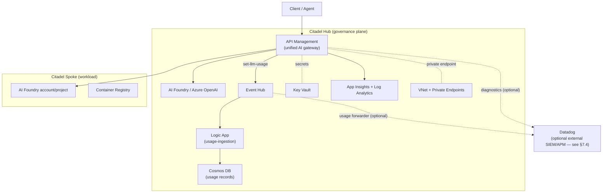
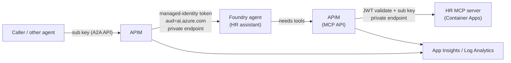
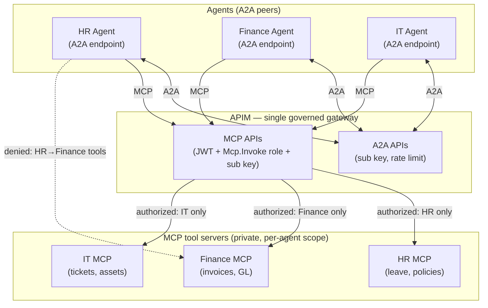
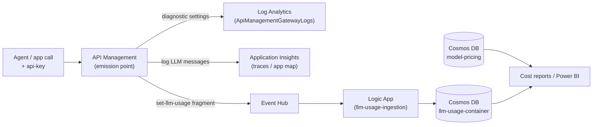
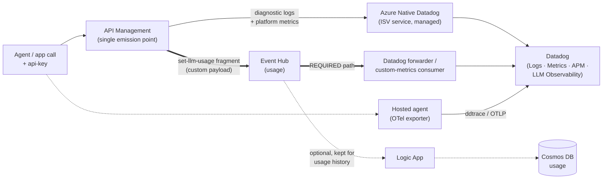

# Citadel — Secure A2A + MCP with Governance-Grade Observability

> A detailed walkthrough of how the **Citadel AI Governance Hub** lets agents and tools
> talk to each other **securely** using **A2A** (agent-to-agent) and **MCP** (Model Context
> Protocol), with **Azure API Management (APIM)** as the single governed gateway — and how that
> same gateway becomes the single emission point for **governance-grade telemetry** (see §7).
>
> Source workshop: <https://aka.ms/citadel-lab>
> (`mohamedsaif/ai-hub-gateway-solution-accelerator`, branch `workshop`, folder `workshop/`).

The [workshop](https://github.com/mohamedsaif/ai-hub-gateway-solution-accelerator/blob/workshop/workshop/readme.md) is organized into four **labs**. Each lab is a step in the guide; the hands-on labs run one or more Jupyter **notebooks** (`.ipynb` files).

| Lab | What you do | Notebooks |
|---|---|---|
| **Lab 1** | Deploy Citadel to your Azure subscription (`azd up` + spoke script) | — |
| **Lab 2** | Review the deployed services and configuration | — |
| **Lab 3** | Run the validation notebooks (in order) | notebooks 1–6 |
| **Lab 4** | Observability: metrics, logs, and telemetry | — |

**Lab 3 notebooks** — run in order:

| # | Notebook | File |
|---|---|---|
| 1 | LLM Backend Onboarding Runner | `1. llm-backend-onboarding-runner.ipynb` |
| 2 | Universal LLM API — All-Models Tests | `2. citadel-universal-llm-api-all-models-tests.ipynb` |
| 3 | Citadel Access Contracts Tests | `3. citadel-access-contracts-tests.ipynb` |
| 4 | Citadel Agent Frameworks Tests | `4. citadel-agent-frameworks-tests.ipynb` |
| 5 | Citadel PII Processing Tests | `5. citadel-pii-processing-tests.ipynb` |
| 6 | Citadel Unified AI API Tests | `6. citadel-unified-ai-api-tests.ipynb` |

**Optional notebooks** — run after notebooks 1–6; these are the **A2A** and **MCP** scenarios this document focuses on:

| # | Notebook | File |
|---|---|---|
| 7 | Citadel Hosted Agent with AGT — build, deploy, and govern a Foundry hosted agent | `7. citadel-hosted-agent-with-agt.ipynb` |
| 8 | Publish and Use an A2A Endpoint — expose a Foundry agent as a governed agent-to-agent endpoint | `8. publish-and-use-a2a-endpoint.ipynb` |
| 9 | Publish and Use the HR MCP via APIM — publish and consume an MCP server through APIM | `9. publish-and-use-hr-mcp-via-apim.ipynb` |

---

## 1. What Citadel is

Citadel Governance Hub is an enterprise **AI landing zone** built around a **hub-and-spoke**
topology:

- **Citadel Hub** — the shared governance plane: **API Management** (the unified AI gateway),
  AI Foundry (two accounts, two regions), Cosmos DB (usage records), Event Hub (usage streaming),
  Key Vault, Log Analytics + Application Insights, a Logic App (usage-ingestion workflow), and a
  **Virtual Network** with private endpoints.
- **Citadel Spoke** — an onboarded workload deployed by the `deploy-spoke-foundry` script: a sample
  Azure AI Foundry account/project plus its own Key Vault, Log Analytics workspace, Application
  Insights, and Container Registry. It connects to the hub as a governed use case.

> **Where this sits in the bigger picture:** the Citadel Governance Hub is the reference
> implementation of **Layer 1 – Governance Hub** of the four-layer **AI Citadel Blueprint**
> (Layer 1 Governance Hub → Layer 2 Agent Operations → Layer 3 Agent Identity → Layer 4 Security
> Fabric). Layer 1 is the *runtime enforcement* plane: a centrally managed AI gateway (APIM) that
> enforces identity validation, rate limiting, and content filtering, while spoke
> environments give each business unit autonomous development within guardrails.

Everything an agent or client does — calling a model, calling another agent (A2A), or calling a
tool (MCP) — flows **through APIM**, which is where authentication, authorization, rate limiting,
and observability live.

---

## 2. The two protocols, and how they combine

Citadel uses the same mental model as a basic A2A/MCP lab, but **every hop is governed by APIM**
and **the backends are private** (public network access disabled).

- **MCP (vertical)** — connects *an agent* **down** to its **tools, data, and actions**. The
  other side is a tool server that does what it's told.
- **A2A (horizontal)** — connects *one agent* **across** to **another autonomous agent**. The
  other side is a peer that reasons and has its own tools.

They are **complementary and layered**, not alternatives:

The **join point**: a Foundry **hosted agent** is published as an **A2A endpoint** (so other
agents/clients can call it) **and** consumes **MCP tools** through APIM. An A2A peer calls the
agent → the agent calls MCP tools → both legs are governed by APIM.

### Multiple agents, each with its own MCP tools

The pattern scales to **many agents talking to each other (A2A)**, where **each agent is allowed
only its own set of MCP tools**. APIM sits in the middle of every hop: it authenticates the A2A
caller, and — separately — authorizes each agent's identity (its `Mcp.Invoke` app role and
subscription) to reach **only** the MCP server(s) scoped to it. An agent cannot reach another
agent's tools because its token/subscription is not granted that MCP API.

> **Scope note:** the workshop itself ships a **single HR agent** (notebook 8) and a **single HR MCP
> server** (notebook 9). The Finance/IT agents and their tool servers in the diagram below are an
> *illustrative generalization* of the same governed pattern — they are not resources the workshop
> deploys.

> **How the scoping is enforced:** each agent has its own managed identity + subscription. APIM's
> MCP policy validates the agent's JWT (audience + `Mcp.Invoke` role) and its subscription key, then
> routes only to the MCP backend that identity is entitled to. The dotted line above shows a request
> APIM **rejects** — the HR agent has no grant to the Finance MCP API, so the cross-tool call never
> reaches the backend.

### What the "A2A APIs" and "MCP APIs" boxes are

Those two boxes are **the APIs you publish inside Azure API Management** — they are how APIM exposes
and governs two different kinds of traffic. APIM has no native concept of "agent" or "tool"; you
import each backend **as an API**, attach policies, and that API becomes the governed front door —
the enforceable **access contract** for that agent or tool.

**A2A APIs (agent-to-agent)**

- **Front:** a Foundry agent's **A2A endpoint** — its incoming "another agent/client can call me"
  interface.
- **Purpose:** let one agent (or a client app) **invoke another autonomous agent** — hand it a task
  and get a reasoned result back. This is the *horizontal* hop (peer ↔ peer).
- **What APIM adds:** subscription-key inbound, rate limiting/quotas, and a
  **managed-identity token** (`aud=https://ai.azure.com`) outbound — so APIM, not the caller,
  authenticates to the private Foundry backend.
- **Shape:** the A2A protocol contract (agent card / task-style HTTP), imported via APIM's
  agent-to-agent API import.

**MCP APIs (Model Context Protocol)**

- **Front:** an **MCP tool server** (e.g. the HR MCP server on Container Apps) exposing `tools/list`
  and `tools/call`.
- **Purpose:** let an agent reach its **tools, data, and actions** ("look up leave balance," "create
  ticket"). This is the *vertical* hop (agent → tools).
- **What APIM adds:** JWT validation **plus** the `Mcp.Invoke` app-role check **plus** subscription
  key (double auth), rate limiting (e.g. 5 `tools/call`/30s), and private routing to the tool backend.
- **Shape:** the MCP JSON-RPC contract, imported as an API so every tool call passes through policy.

| | A2A API | MCP API |
|---|---|---|
| Connects | agent ↔ agent (horizontal) | agent → tools (vertical) |
| Other side is | an autonomous reasoning peer | a tool server that executes commands |
| Caller | another agent / client app | an agent that needs to *do* something |
| APIM auth | sub key + JWT, MI token to backend | sub key + JWT + `Mcp.Invoke` role |

They are kept as **separate API types** because they govern **different trust relationships and
different authorization rules**. That separation is exactly what lets APIM say "Agent A may call
Agent B (A2A) and may use the HR tools (MCP), but may **not** touch the Finance tools" — each API +
subscription + role grant is scoped independently. That per-agent grant (API + product/subscription +
app-role) is precisely what Citadel calls an **access contract** (defined under
*What an access contract is*, below). In the diagram above, every solid line passes
through one of these two API types, which is how APIM stays the single governed choke point for both
kinds of traffic.

The workshop demonstrates this across three notebooks:

| Notebook | Role |
|---|---|
| `7. citadel-hosted-agent-with-agt.ipynb` | Build, deploy, and **govern** a Foundry hosted agent (AGT = **[Microsoft Agent Governance Toolkit](https://microsoft.github.io/agent-governance-toolkit/)** — policy, capability guard, audit trail, rogue detection, plus OpenTelemetry) |
| `8. publish-and-use-a2a-endpoint.ipynb` | Expose a Foundry agent as a **governed A2A endpoint** through APIM |
| `9. publish-and-use-hr-mcp-via-apim.ipynb` | Publish an **MCP tool server** through APIM and have a hosted agent consume it |

---

## 3. The A2A leg — how it works (notebook 8)

**Goal:** run an agent, expose its incoming A2A endpoint, and publish it through APIM as a
governed access contract — callable with just a subscription key, even though the agent's backend
stays private. The specifics below are intentionally generic; the exact agent type, card paths,
file names, role assignments, and policy values live in the workshop notebooks and the Citadel
accelerator.

### How it works (conceptually)

The same pattern applies whether the agent is a Foundry-hosted agent or a containerized agent
built with a framework such as Microsoft Agent Framework:

- **The agent publishes an A2A contract** — an *agent card* (its description, version, and skills)
  plus a JSON-RPC endpoint that accepts A2A messages and tasks.
- **APIM fronts the agent as a governed API** — the agent's runtime URL becomes the API backend,
  and the API requires a **subscription key**, so callers authenticate to the gateway rather than
  to the agent directly.
- **APIM authenticates to the backend with its own managed identity** — an inbound policy mints a
  backend token from APIM's managed identity (the token audience matches whatever the agent's
  runtime expects), so callers never see the agent's credentials.
- **Governance lives at the gateway** — a product + subscription scopes who may call the agent,
  and policies add rate limiting and optional message logging (method, task id, correlation id) to
  Application Insights. Streaming responses are logged as metadata only, to avoid breaking SSE.
- **The backend can stay private** — because APIM reaches it over the VNet / a private endpoint,
  the agent works even with public network access disabled.

---

## 4. The MCP leg — how it works (notebook 9)

**Goal:** publish an HR MCP tool server through APIM and consume it — first directly, then from a
Foundry hosted agent. The agent's tools come from the **APIM-published MCP**, not local code.

### Key facts

- **MCP server** (FastAPI app implementing the MCP JSON-RPC protocol) runs in **Container Apps**, fronted by APIM at `/hr-mcp/mcp`.
- **Tools:** `search_employees`, `get_employee_profile`, `recommend_learning_path`,
  `submit_pto_request`, `update_employee_skills`.
- **Double authentication on every call** — the client sends *both*:
  - `Authorization: Bearer <delegated Entra token>` for the MCP scope/audience — **APIM validates
    the JWT** (audience + required scope/app-role claim), and
  - `Ocp-Apim-Subscription-Key` — the access-contract subscription key.
- **Access contract + rate limit** — product `MCP-HR-Tools-DEV` + subscription, with a policy
  enforcing **5 `tools/call` per 30 seconds → HTTP 429** (demonstrated explicitly in the notebook).
- **Bounded logging** — request/response snippets are logged with an explicit rule that **bearer
  tokens and subscription keys must not be logged**.

### The A2A ↔ MCP join (notebook 9, step 10)

A Foundry **hosted agent** is built (image via `az acr build`), deployed into the spoke project,
and given tools from the **HR MCP via APIM** (`hr_mcp_via_apim`). The agent authenticates to APIM
using **its own managed identity**:

- it requests a **fresh Entra token** per call for the MCP API (application app role
  **`Mcp.Invoke`**), **plus** the APIM subscription key;
- its managed identity is granted **`Foundry User`** on the spoke account and the **`Mcp.Invoke`**
  app role via Microsoft Graph `appRoleAssignedTo`.

This is exactly the kind of agent that notebook 8 publishes over A2A — so an A2A peer can call it,
and it in turn calls MCP tools, **all through APIM**.

---

## 5. End-to-end: A2A → agent → MCP

Putting both legs together, a single request from a peer agent flows through **two governed hops**:
the peer calls the agent's A2A endpoint (subscription key), APIM forwards to the private Foundry
agent with a managed-identity token, the agent calls its MCP tools through APIM (fresh Entra JWT
with the `Mcp.Invoke` app role plus subscription key), and the result flows back out the same path.

---

## 6. Security model — what makes Citadel production-grade

| Control | Basic `apim-mcp-a2a` demo lab | Citadel A2A + MCP |
|---|---|---|
| Client authentication | Shared subscription key only | **JWT validation (`validate-jwt`)** with audience + scope/app-role (`Mcp.Invoke`) **and** per-contract subscription key |
| Backend identity | Subscription key passed through to apps | **APIM managed identity** mints backend tokens (`aud=https://ai.azure.com`); callers never receive a backend token |
| Agent → tool identity | Static shared key | Agent uses **its own managed identity** to get a **fresh Entra token per request** |
| Network | All apps public ingress | Foundry/MCP backends **private; public network access disabled**; APIM reaches them over **private endpoints** |
| Multi-consumer access | One shared key for everything | **Access contracts** = per-consumer APIM **product + subscription** |
| Rate limiting | None | `rate-limit` at product scope (A2A: 3/60s; MCP: 5 `tools/call`/30s → 429) |
| Logging | Minimal | Bounded `<trace>` body logging to App Insights with **explicit secret redaction** |
| RBAC granularity | Broad APIM Contributor on a shared UAI | Scoped roles: APIM MI → *Cognitive Services User*; agent MI → *Foundry User* + `Mcp.Invoke` app role |
| Secrets | In Container Apps env vars | **Key Vault** for secrets/certs |
| Content governance | None | **PII detection** + **Content Safety** policy fragments; token/usage metrics to Cosmos DB |

### Why "private backends + APIM" is the key idea

- Backends (Foundry agent, MCP server) have **public network access disabled**.
- **APIM is the only identity allowed to reach them**, over a **private endpoint**, using its
  **managed identity**.
- **APIM is also the only thing that validates inbound** JWTs and subscription keys.

So APIM is the **trust boundary**: identity is verified on the way in (client JWT + subscription
key) and asserted on the way out (managed-identity backend token), and nothing on the public
internet can reach the agent or the tools directly.

### Identity flows end-to-end

- A2A callers present a **subscription key** (per access contract).
- The agent presents **its own managed-identity Entra token** (app role `Mcp.Invoke`) to call MCP.
- No long-lived shared secret carries the backend identity — which is the main gap in a basic demo
  lab where one shared key is reused for everything.

### What an access contract is

An **access contract** is the formal "terms of access" attached to a published agent or tool in
APIM — it defines **who may call it, how they authenticate, and the limits they are bound to**. In
Citadel (notebook 8), the agent is published "as a governed **access contract** — callable with
just a subscription key, even though the Foundry account is private."

In Citadel these contracts are **declared as infrastructure-as-code** (`.bicepparam` files) and
enforced at runtime by the gateway — part of a **contract-driven governance** model with two sides:
**Backend Contracts** (the supply side — which LLM backends/models the gateway may route to) and
**Access Contracts** (the demand side — which use cases/agents may consume them, and under which
policies). A **Publish Contract** type (for tools/agents a spoke exposes back to the hub) is
upcoming. Recommended granularity is **one contract per business-unit / use-case / environment**.

Concretely, an access contract resolves to a bundle of APIM constructs:

| Piece | What it defines |
|---|---|
| **API** | the published surface (the A2A or MCP endpoint) |
| **Product** | the package a consumer subscribes to (groups one or more APIs) |
| **Subscription** | the consumer's credential (subscription key) + which product they are entitled to |
| **Policies** | the enforced terms — `validate-jwt`, `Mcp.Invoke` role check, `rate-limit`, `quota`, IP rules |
| **Backend auth** | how APIM authenticates onward (managed-identity token) so the caller never sees backend secrets |

So when a peer or external agent is "granted an access contract" to a Citadel agent, it means:
*here is your subscription key, you may call this specific A2A/MCP API, at this rate, with these
auth requirements, and nothing else.* That is exactly what makes the multi-agent scoping work —
"Agent A has an access contract to the HR tools but **not** the Finance tools." The contract is the
unit of entitlement APIM enforces on every call.

### Can Citadel agents talk to agents in other clouds?

**Yes — at the protocol level, because A2A is just authenticated HTTP.** Citadel does not lock A2A
to Azure; it *governs* it. Two directions:

- **External agent → Citadel agent (inbound).** APIM publishes the Citadel agent's A2A endpoint as a
  **public HTTPS API** (the backend stays private; only APIM is exposed). Any A2A-capable agent —
  running in AWS, GCP, on-prem, or another tenant — can call it **as long as it presents the required
  credentials** (subscription key + JWT). The caller's hosting cloud is irrelevant; it just needs
  network reachability to the APIM gateway and a valid access contract.
- **Citadel agent → external agent (outbound).** A Citadel agent can call an A2A agent that lives
  elsewhere, but to keep it governed you **register that external agent as a backend/API in APIM** and
  route the call through the gateway (so auth, rate limiting, and logging still apply). If the agent
  calls straight out without going through APIM, it works but you lose the governance.

Cross-cloud caveats (the usual realities):

- **Identity** — Entra JWT works cleanly inside the Microsoft identity world. Cross-cloud callers
  either get a **subscription key**, or you federate their identity provider (e.g. Workload Identity
  Federation / OIDC) so APIM's `validate-jwt` trusts their tokens.
- **Network** — public HTTPS is the simplest path; for private connectivity add VPN / peering /
  Private Link.
- **TLS everywhere** — every hop should be HTTPS; do not expose plaintext A2A across clouds.

In short, Citadel makes agents **cloud-agnostic consumers and providers**: APIM is the neutral,
governed meeting point in the middle, and the access contract is what each external party is issued.

---

## 7. Telemetry & observability

Citadel treats observability as a **built-in capability of the governance hub**, not something each
team bolts on. Because every call is forced through APIM (private backends, no direct access), the
gateway becomes the **single emission point for governance-grade telemetry** — traffic and **token
usage** (token counts + model + calling product). The key consequence is that apps
and agents **don't have to instrument themselves** to be observed and metered: APIM produces that
telemetry *about* every call and **fans it out through a pipeline of other Azure services**. Apps
and agents may still emit their *own* application traces
(the hosted agent, for example, can export OTel/agent spans — see §7.4); those **complement** the
gateway stream rather than replace it. The workshop's **Lab 4** is simply the *read* side of the
gateway pipeline.

### 7.1 Two telemetry streams from one gateway

APIM is configured to produce **two independent streams**:

| Stream | How it's produced | Path | Answers |
|---|---|---|---|
| **A. Diagnostic** (synchronous, automatic) | APIM **diagnostic settings**; APIs have **"Log LLM messages"** enabled | APIM → **Log Analytics** (logs/metrics) and **Application Insights** (traces) | "Is the gateway healthy? volume, latency, errors, throttling, end-to-end trace" |
| **B. Usage** (asynchronous, policy-driven) | The reusable **`set-llm-usage`** policy fragment captures token counts + model + calling product | APIM → **Event Hub** → **Logic App** → **Cosmos DB** | "Who consumed how many tokens, on which model, at what cost — per access contract" |

Stream **B** is what makes Citadel's observability *governance-grade* rather than just APM: **token
usage** is captured **at the gateway**, attributed to the **access contract** (APIM
`productId`) that made the call, and shipped **off the hot path** so capturing it adds **zero
latency** to inference.

### 7.2 Which services are involved (and why)

Telemetry is **not** an APIM-only feature — it is a chain of services, each with a distinct role:

| Service | Role in telemetry |
|---|---|
| **API Management** | The single emission point — emits diagnostics and runs the `set-llm-usage` policy fragment on every LLM call |
| **Log Analytics** | Stores gateway logs/metrics; queried with KQL over `ApiManagementGatewayLogs` (volume, P50/P95/P99 latency, `429`s, per-API/per-subscription split) |
| **Application Insights** | Distributed tracing — **Application Map** (APIM ↔ Foundry backends) and **Transaction Search** (request → policy → backend → response) |
| **Event Hub** | Decouples usage capture from the request — buffers the per-call usage events emitted by the policy fragment |
| **Logic App** (`llm-usage-ingestion`) | Consumes Event Hub and writes structured usage records into Cosmos DB |
| **Cosmos DB** | `llm-usage-container` (per-call tokens, model, **product/contract**, timestamp) joined with `model-pricing` for **per-contract, per-model cost** |
| **Power BI** (optional) | Dashboards over the Cosmos usage + pricing data |
| **AGT** (Microsoft Agent Governance Toolkit, optional agent layer) | The hosted-agent notebook governs the agent with AGT (policy, capability guard, audit trail, rogue detection) and emits AGT OpenTelemetry — `agt.policy.*` spans and `agt.audit.event` records — for **agent-level** governance, complementary to the gateway telemetry above |

### 7.3 How the workshop exercises it (Lab 4)

`azd up` deploys the whole pipeline (App Insights `appi-apim-*`, Log Analytics `log-*`, Event Hub
`evhns-*`, Logic App `logic-*`, Cosmos `cosmos-*`). **Lab 4** then has you *generate* telemetry by
running notebooks 1–6 and *inspect* it across the three surfaces:

- **APIM Analytics / Metrics / Logs** — Timeline, Subscriptions (per-contract), Language Models tab; KQL on `ApiManagementGatewayLogs`.
- **Application Insights** — Application Map + Transaction Search for end-to-end traces.
- **Cosmos usage** — manually **Run** the `llm-usage-ingestion` Logic App (in a short lab you don't wait for the schedule), then query `llm-usage-container` for per-call tokens/model/product.

> **Scope note:** the streams above are **gateway / LLM telemetry** (requests, **token usage**,
> routing). They do
> **not** capture agent-framework internals (A2A turn spans, MCP tool-call
> spans). For that, the optional hosted-agent notebook governs the agent with **AGT** (Microsoft
> Agent Governance Toolkit) and emits its OpenTelemetry policy/audit signals at the agent layer,
> which also land in Application Insights.

### 7.4 Routing telemetry to Datadog (or another SIEM/APM)

Nothing in the design is locked to Azure Monitor. The telemetry splits into **two distinct planes**,
and **each plane has exactly one correct path to Datadog** — they are not interchangeable options:

| Plane | What it carries | Path to Datadog | Why this path |
|---|---|---|---|
| **Diagnostic plane** | APIM gateway **logs + platform metrics** (`ApiManagementGatewayLogs`, latency, 429s, etc.) | **Azure Native Datadog** ISV service | These are standard Azure Monitor categories, so the managed ISV integration forwards them automatically (it creates the diagnostic settings and gets *Monitoring Reader* for metrics). No Event Hub, no forwarder to run. |
| **Usage plane** | Per-call **token counts, model, calling product** emitted by `set-llm-usage` | **Event Hub → Datadog forwarder** (**required**) | This is a **custom application payload the policy publishes directly to Event Hub** — it is **not** an Azure Monitor log category, so Azure Native Datadog *cannot* see it. The Event Hub seam is the **only** way to get this stream into Datadog. |
| **Agent-span plane** | A2A turn / MCP tool-call **traces** | Agent-layer **OpenTelemetry** exporter (`ddtrace` / OTLP) | Spans originate in the hosted agent, not the gateway, so they're exported directly from the agent. |

So the choice is **not** "Azure Native Datadog *or* Event Hub." You use **both, for different data**:
Azure Native Datadog for the diagnostic plane (managed, includes metrics), and the **Event Hub seam
for the usage plane** because nothing else can carry that custom token stream.

> **Note:** Azure Native Datadog can *also* be replaced by a manual *diagnostic settings → Event Hub →
> forwarder* path if you specifically need to transform or route the diagnostic logs yourself — but
> for the usage plane the Event Hub path is **mandatory**, not a preference.

The key point: **keep the `set-llm-usage` policy fragment unchanged** — it already publishes to Event
Hub. You only add a parallel consumer.

> **Why it's clean:** the gateway and the agents never learn where telemetry ends up — they emit to
> diagnostic settings, an Event Hub, and an OTel endpoint. Re-targeting to Datadog (or Splunk,
> Elastic, etc.) is purely a **downstream consumer** change, so it can run **side-by-side** with the
> existing Azure Monitor + Cosmos pipeline during a migration.

---

## 8. Comparing other repos to Citadel

| Gap in other repos | Citadel notebook / mechanism that closes it |
|---|---|
| Public ingress on all apps | Private endpoints + `publicNetworkAccess: Disabled` (notebooks 8 & 9) |
| Shared subscription key only | `validate-jwt` + app roles (`Mcp.Invoke`) — notebook 9 |
| Key passed through to apps | `authentication-managed-identity` backend auth — notebook 8 §10.3 |
| No rate limiting | Product-scope `rate-limit` — notebooks 8 & 9 |
| Secrets in env vars | Key Vault (hub) |
| Broad APIM Contributor role | Scoped *Cognitive Services User* / *Foundry User* + app role |
| A2A ingress allows HTTP | Private, HTTPS-only backends behind APIM |

---

## 9. Key takeaways

- **A2A and MCP are layered, not competing.** The agent is an A2A endpoint *and* an MCP consumer;
  APIM governs both legs identically (auth + rate limit + private routing + telemetry).
- **APIM is the trust boundary.** Backends are private; APIM is the only thing with an identity
  allowed to reach them and the only thing that validates inbound credentials.
- **Identity flows end-to-end.** Subscription keys gate the front door; the agent's own managed
  identity (with the `Mcp.Invoke` app role) authenticates the agent-to-tool hop — no static shared
  secret carries backend identity.
- **"Agents talking to each other securely"** = publish the agent as A2A (notebook 8) + have that
  agent call MCP tools through APIM (notebook 9 step 10), composed through one governed gateway.

---

## 10. Is Citadel a production-ready A2A + MCP implementation?

**Short answer: Citadel is a production-*grade* reference architecture, but it is not a drop-in
production system.** It demonstrates the right patterns, but you still have to harden, scale-test,
and operationalize it for your own environment.

### 10.1 What Citadel does that *is* production-quality

| Concern | Citadel approach | Production-ready? |
|---|---|---|
| Network exposure | Backends are **private** (private endpoints + VNet); only APIM is reachable | ✅ Yes — correct trust-boundary design |
| Authn (client → gateway) | **JWT validation** (Entra) + **subscription keys** on MCP/A2A | ✅ Yes |
| Authz | App roles (`Mcp.Invoke`), `validate-jwt` audience/role checks | ✅ Yes |
| Backend auth | APIM → AI Foundry / agent via **managed identity** (`authentication-managed-identity`) | ✅ Yes — no secrets in transit |
| Rate limiting / abuse | `rate-limit` per subscription (e.g. 3/60s A2A, 5/30s MCP) | ✅ Pattern is right (values are demo-sized) |
| Secrets | **Key Vault** + named values, no inline keys | ✅ Yes |
| Observability | Log Analytics + App Insights + Event Hub + Cosmos usage ingestion | ✅ Yes |
| Content safety / PII | Content Safety + PII policies on the AI path | ✅ Yes |

### 10.2 What you still must do before calling it production

1. **Tune the rate limits / quotas.** The `3 calls / 60s` and `5 calls / 30s` values are teaching
   defaults — they'll throttle real traffic instantly. Replace with capacity-based limits and add
   `quota` policies.
2. **APIM SKU & scale.** The workshop uses **StandardV2** (single region). For real production you
   typically want **Premium** for multi-region, VNet injection at scale, availability zones, and
   higher throughput — or at least validate StandardV2 limits against your load.
3. **High availability / DR.** It's single-region. Add multi-region APIM, paired AI Foundry
   deployments, and Cosmos/Event Hub geo-redundancy. Run a failover test.
4. **A2A allows-HTTP edge cases.** Verify every A2A hop is TLS-only end to end (no plaintext
   ingress on any Container App / agent).
5. **Token lifecycle & key rotation.** Subscription keys are long-lived; production should lean
   harder on JWT-only where possible, automate key rotation, and scope subscriptions per consumer.
6. **Threat protection.** Add jailbreak/prompt-shield, request size limits, and IP allow-lists
   where the consumer set is known.
7. **Load & chaos testing.** None of the notebooks prove throughput, latency under load, or
   behavior when a backend agent is down. That's on you.
8. **CI/CD + policy-as-code.** The notebooks apply policies interactively; production needs the
   policies/Bicep in a pipeline with environments and approvals.
9. **Cost governance.** Usage ingestion (Cosmos/Event Hub/Logic App) is for *visibility* — you
   still need budgets, alerts, and per-team chargeback enforcement.

---

## References

- Citadel workshop lab guide — <https://aka.ms/citadel-lab>
- Enable an agent-to-agent endpoint —
  <https://learn.microsoft.com/azure/foundry/agents/how-to/enable-agent-to-agent-endpoint>
- Import an A2A agent API (APIM) —
  <https://learn.microsoft.com/azure/api-management/agent-to-agent-api>
- Model Context Protocol — <https://modelcontextprotocol.io>
- Preventing Cross-Subscription Access (OpenAI ResponsesAPI) - <https://github.com/Azure-Samples/ai-hub-gateway-solution-accelerator/blob/citadel-v1/guides/llm-access-guide.md#step-15-responses-api-id-security-responses-id-security--responses-id-cache-store>
- Citadel source repo (`ai-hub-gateway-solution-accelerator`, `workshop` branch) —
  <https://github.com/mohamedsaif/ai-hub-gateway-solution-accelerator/tree/workshop/workshop>
- Expose and govern an MCP server in API Management —
  <https://learn.microsoft.com/azure/api-management/export-rest-mcp-server>
- `authentication-managed-identity` policy (backend auth via APIM MI) —
  <https://learn.microsoft.com/azure/api-management/authentication-managed-identity-policy>
- `validate-jwt` policy (inbound JWT + audience/role checks) —
  <https://learn.microsoft.com/azure/api-management/validate-jwt-policy>
- `rate-limit` / `rate-limit-by-key` policies —
  <https://learn.microsoft.com/azure/api-management/rate-limit-policy>
- Products and subscriptions (access contracts) in API Management —
  <https://learn.microsoft.com/azure/api-management/api-management-howto-add-products>
- Use private endpoints with API Management —
  <https://learn.microsoft.com/azure/api-management/private-endpoint>
- Monitor published APIs (APIM diagnostics, Azure Monitor, App Insights) —
  <https://learn.microsoft.com/azure/api-management/api-management-howto-use-azure-monitor>
- Integrate Azure API Management with Application Insights —
  <https://learn.microsoft.com/azure/api-management/api-management-howto-app-insights>
- `ApiManagementGatewayLogs` resource log schema —
  <https://learn.microsoft.com/azure/api-management/monitor-api-management-reference>
- Log to Event Hub from API Management —
  <https://learn.microsoft.com/azure/api-management/api-management-howto-log-event-hubs>
- Azure Native Datadog (ISV) service overview —
  <https://learn.microsoft.com/azure/partner-solutions/datadog/overview>
- Forward Azure logs to Datadog via Event Hub —
  <https://docs.datadoghq.com/logs/guide/azure-logging-guide/>
- Datadog LLM Observability —
  <https://docs.datadoghq.com/llm_observability/>
- Azure AI Content Safety overview —
  <https://learn.microsoft.com/azure/ai-services/content-safety/overview>
- Workload identity federation (cross-cloud / external token trust) —
  <https://learn.microsoft.com/entra/workload-id/workload-identity-federation>
